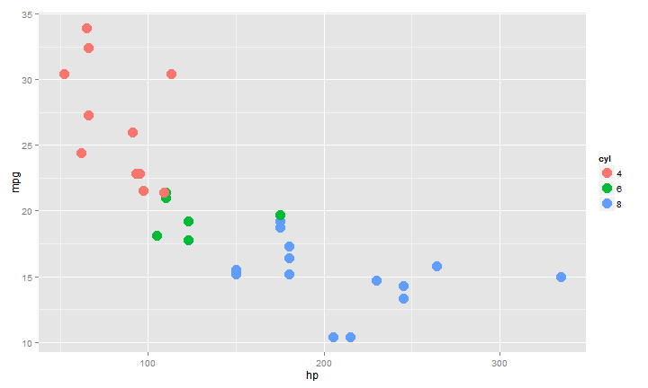

### The Application Overview

- The application is a simple demonstrative [Shiny App](http://shiny.rstudio.com/) made as a course project of  [Developing Data Product](https://www.coursera.org/course/devdataprod), part of [Data Science Specialization](https://www.coursera.org/specializations/jhudatascience), offered by [John Hopkins Bloomberg School of Plublic Health](http://www.jhsph.edu/), at [Coursera](href="http://www.coursera.org).

- The app loads the [MTCars](https://stat.ethz.ch/R-manual/R-devel/library/datasets/html/mtcars.html), *Motor Trend Car Road Tests* dataset and allow you to plot, using [GGPlo2](http://ggplot2.org/), any numeric dimention agains another numeric dimension.

- It is possible too, choose a factor dimention to group the data points, and also, show a linear model fitted in the chart itself. The application dynimic handle, in the **Server** code, the options of **Parameter Panel**, defined in the **UI**, to plot a chart in the **Chart Panel**.

- We slip, and covert, some features in the dataset as *numeric* to be used as X and Y variables, and as *factors* to be used as grouping options. At the **UI.R** code, we just split the name of the features to be load in the appropriated input widgets, and at the **server.R** code we also convert the relevant numeric features to factors.

- The project GitHub, with the source code can be find at: https://github.com/GiulSposito/DDP-Project

---

### ui.R

Defining *numeric* and *factors* features and populating the input widgets

```r
numAxis <- c("mpg","disp","hp","drat","wt","qsec")
facData <- c("none","cyl","vs","am","gear","carb")
# (...)
selectInput("x","X Axis", numAxis),
selectInput("y","Y Axis", numAxis),
radioButtons("groupBy","Group by", facData),
```

We use a **Conditional Panel** to show or hide an option to facet the chart, if there are no *grouping factor* defined, this option isn't showed

```r
# this is condicional, will appear only if a 'group by' is choosed
conditionalPanel(
  condition="input.groupBy!='none'",
  checkboxInput("facet","Use facets") #show a option to 'facet' the chart
), 
```

--- 

### server.R

To build the chart in the server code, we use `aes_string` to define X and Y variables, instead of `aes` because we are using the string containing the feature name, passed by input widgets. `as.formmula` is used to convert the *string* grouping factor in a *formula* in the `facet_wrap`. Also, we use the *gramatical* aspect of **GGPlot** to add (or not) the *facet* and the *linear* regression.


```r
shinyServer(
  function(input,output){   
    output$plot <- renderPlot({
      g <- ggplot(mtcars, aes_string(x=input$x, y=input$y)) + geom_point(size=5) 
      if (input$groupBy!="none") g <- g + aes_string(col=input$groupBy)
      if (input$lm) g <- g + geom_smooth(method="lm")
      if (input$groupBy!="none" & input$facet) 
          g <- g + facet_wrap(as.formula(paste("~", input$groupBy)))
      g + theme_solarized() # add a theme and return g
    })
  }
)
```

---

### GGPlot aes_string example


```r
  library(ggplot2); data(mtcars); mtcars$cyl <- as.factor(mtcars$cyl)
  ggplot(mtcars, aes_string(x="hp", y="mpg", col="cyl")) + geom_point(size=5)
```

 


